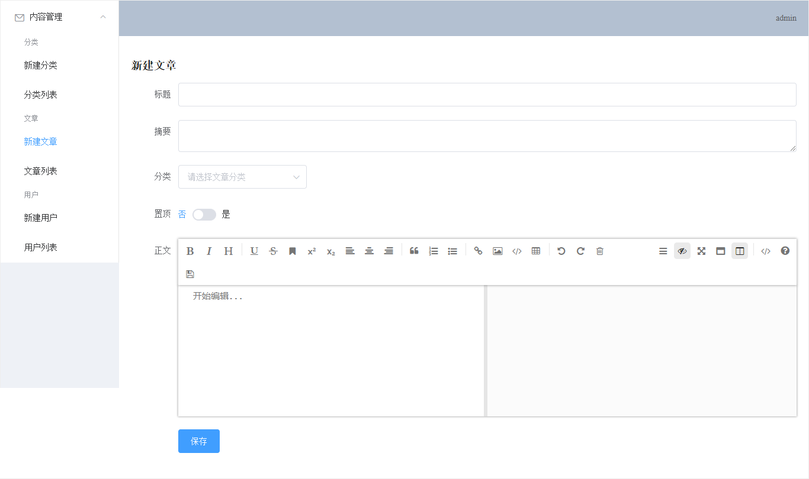
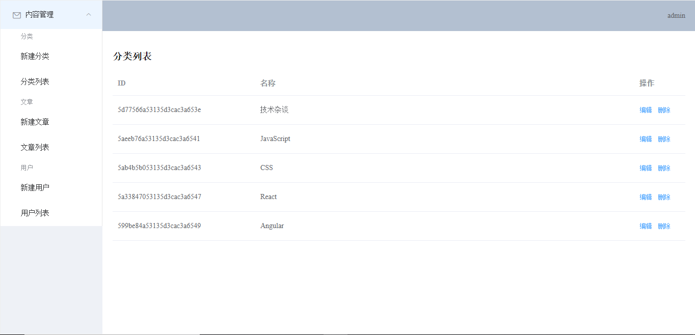
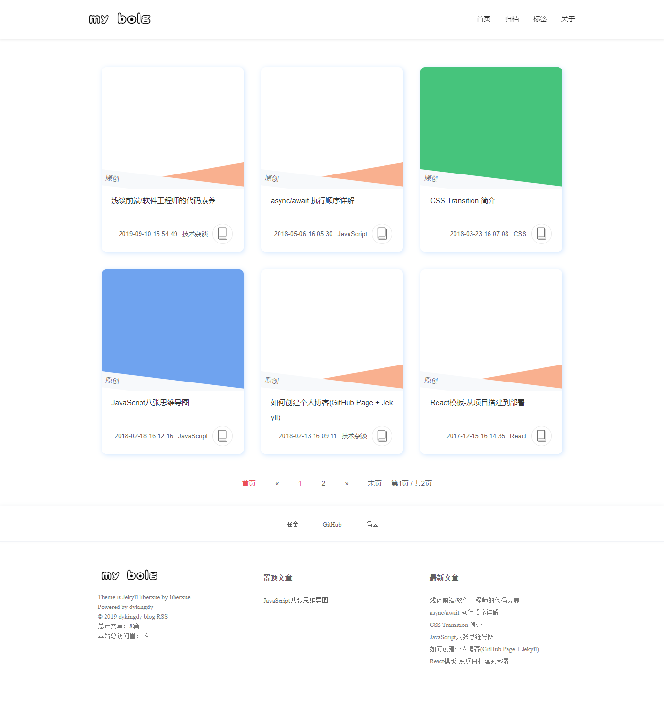
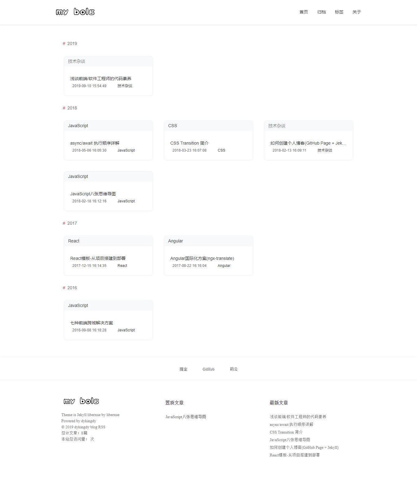

### 环境准备
  ## vue-cli
  ## nodejs
  ## mongodb

### 新增分类
### 分类列表(增删改查)

### 新增文章
### 文章列表(增删改查)
### Markdown编辑器集成
### 图片上传功能

### 新增用户
### 用户列表(增删改查)

### 通用增删改查接口实现(中间件resourceMiddleware)

### 登录功能
### 登出功能
### 添加jwt校验（1. 用户名查找 2. 密码校验 3. 返回token）
### 添加http拦截器（request、response)

### 博客首页UI
### 博客首页接口实现
### 博客归档页面UI
### 博客归档页面接口实现
### 博客标签页面UI
### 博客标签页面接口实现

### 访问量统计功能

### 项目打包
### 域名购买
### 域名解析
### 云服务购买
### git安装, ssh key添加
### ngnix配置
### mongodb配置
### mongodb数据导入

### 新建文章

### 分类列表

### 博客首页

### 博客归档页

### 博客标签页
